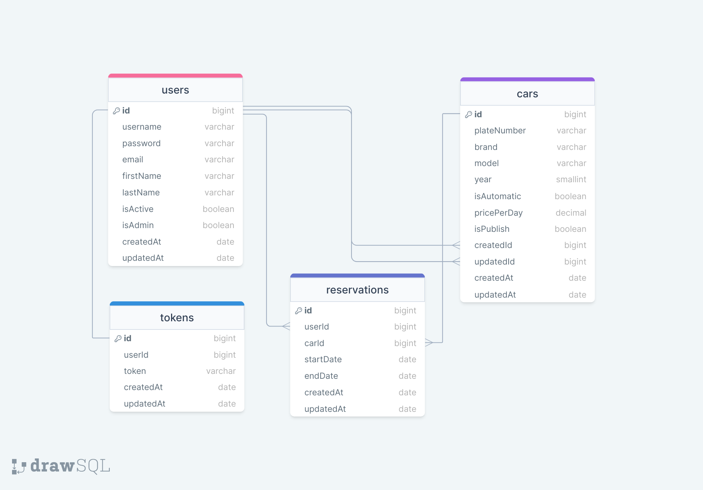

# RENT A CAR API

swagger: https://rentacar-express-api.vercel.app/documents/swagger
swagger: https://rentacar-express-api.vercel.app/documents/redoc
### ERD:

--- 

### Rent A Car Project 

- Customers;
  - can select start and end date and see the list of available cars on selected dates.
  - can not reserve cars which are reserved by other customers on selected time period.
  - can choose a car on the list and reserve that car, but can not reserve more than one car on a selected time period,
  - can see the list of their reservations including past ones.
  - can list, create, read their reservations.
  - can not update, delete reservations.

- Admins;
  - can make CRUD operations on Car table,
  - can make CRUD operations on Customer (User) table,
  - can make CRUD operations on Reservation table,

- It can be createdId and updatedId in Car model.
- There will be searching, sorting and pagination capabilities on list views.

---

###  Araç Kiralama Projesi

* Müşteriler:
  * Tarih aralığı belirtip müsait araç listeleyebilir.
  * Rezerve edilmiş bir aracı, o tarihlerde rezerve edemez.
  * Seçilen tarih aralığında araç rezerve edilebilir, ancak aynı tarih aralığında ikinci bir araç kiralayamaz.
  * Rezervasyonlarını listeyebilir, ekleyebilir, okuyabilir.
  * Rezervasyonlarını güncelleyemez, silemez.
* Yöneticiler:
  * Araba tablosu CRUD işlemleri
  * Müşteri (User) tablosu CRUD işlemleri
  * Reservasyon tablosu CRUD işlemleri

* Araba tablosunda createdId ve updatedId olabilir.
* Listeleme ekranlarında arama, sıralama ve sayfalama imkanları olacaktır.

---
